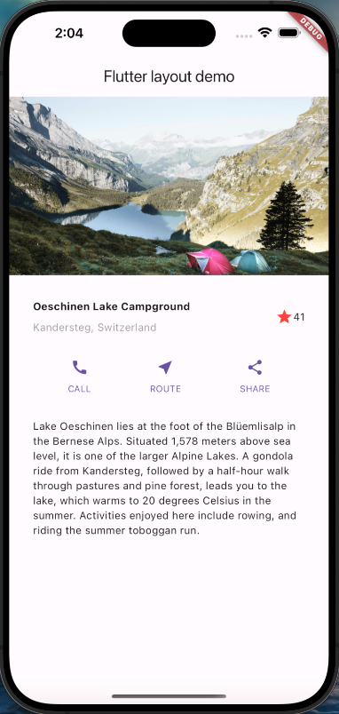
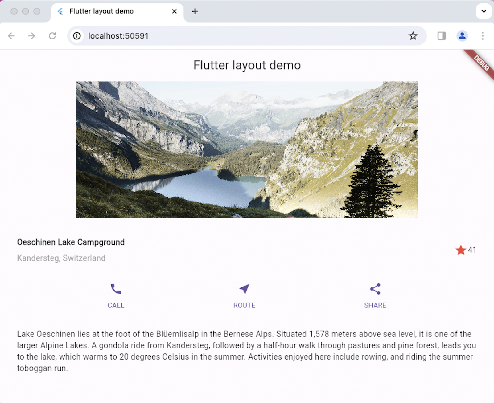

# exercise3

### Layout tutorial

https://flutter.dev/docs/development/ui/layout/tutorial

Optionally - Try above example for Desktop and Web platforms as well 

Ref: https://flutter.dev/desktop and Building a web application with Flutter - Flutter,  https://flutter.dev/web

### Output on iOs and Chrome:

