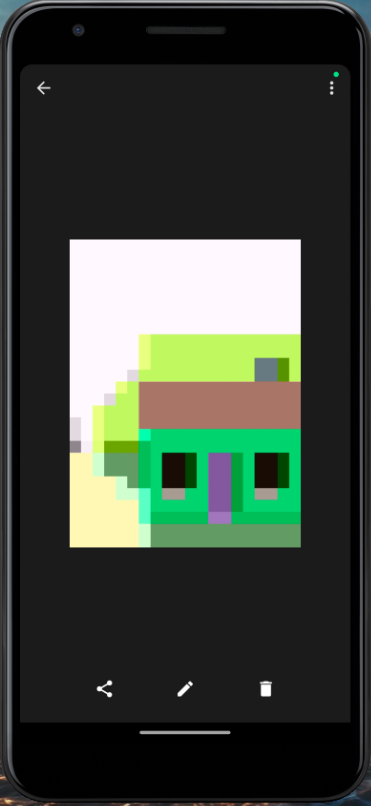
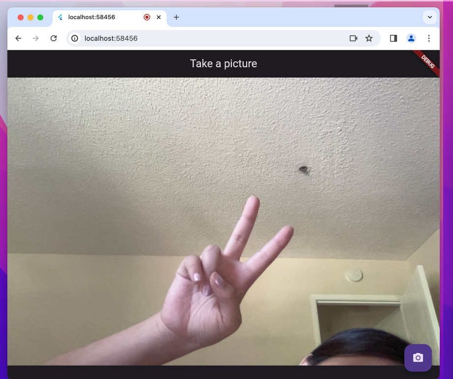

# exercise5

### Take a picture using the Camera (recommend using Android Emulator and its built-in camera simulation)

https://flutter.dev/docs/cookbook/plugins/picture-using-camera

Additional References:

https://www.geeksforgeeks.org/camera-access-in-flutter/

https://www.woolha.com/tutorials/flutter-access-camera-and-capture-image-example 

### Output on Mobile phone && web:

